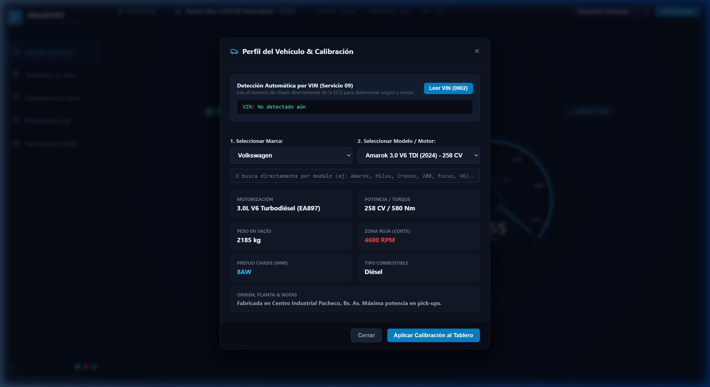
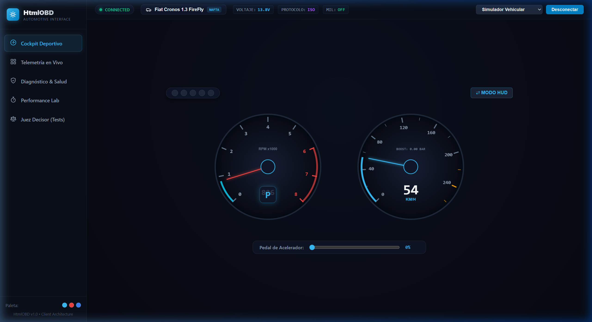

# ⚡ HtmlOBD - Interfaz Web de Telemetría & Diagnóstico Automotriz

> Aplicación web de telemetría y diagnóstico automotriz desarrollada en **HTML5 + Vanilla CSS + JavaScript (ES Modules)**, con soporte para **Web Serial API**, **Web Bluetooth API**, detección de **VIN** (Servicio 09), catálogo completo multimarca de **modelos del mercado argentino** y un simulador de física vehicular integrado.

---

## 🌟 Visión & Síntesis de Referentes de la Industria

**HtmlOBD** integra las mejores características de las aplicaciones de diagnóstico más prestigiosas del mercado internacional, adaptadas con una estética sobria y profesional:

| Referente | Función / Pro Clonado | Implementación en HtmlOBD |
| :--- | :--- | :--- |
| **RealDash** | **Cockpit de Alto Rendimiento** | Instrumentación analógica y digital fluida en Canvas a **60 FPS** con inercia, barrido de agujas (*sweep*), shift lights perimétricos y **Modo HUD** de proyección en parabrisas. |
| **BimmerLink** | **Telemetría Modular OLED** | Cuadrícula responsiva de tarjetas oscuras con micro-gráficos de tendencia (**sparklines**) de 30 segundos, seguimiento de picos **Min/Max** y alertas visuales por umbral. |
| **OBDeleven** | **Salud Global & Visualización de Chasis** | Esquema vectorial SVG del vehículo con detección de fallas por nodo (Motor, Transmisión, Frenos/ABS, Escape) y cálculo porcentual de salud. |
| **Car Scanner** | **Diagnóstico Clínico & Consola** | Lectura y borrado de fallas DTC (**Servicios 03 y 04**), base de datos de severidad y causas probables, y terminal serie interactiva con sniffer de tramas HEX. |
| **RaceChrono** | **Performance Lab & Datalogger** | Cronómetro automático de aceleración (**0–100 km/h** y **1/4 de milla**) por integración de velocidad, gráfica multicanal y exportación a **CSV / JSON**. |

---

## 🇦🇷 Catálogo Completo de Marcas & Modelos de Argentina

HtmlOBD incluye un selector en cascada por **Marca**, **Modelo** y **Buscador predictivo en tiempo real**, cubriendo los principales modelos históricos y actuales del mercado argentino:


*Figura: Modal de selección con marcas y modelos completos de Argentina y ficha técnica.*

### Marcas y Modelos Precargados:
* **Toyota:** Hilux 2.8 D-4D (Zárate, 204 CV), Hilux 2.4 D-4D (150 CV), SW4 2.8 D-4D, Corolla 2.0 Dynamic Force (170 CV), Corolla 1.8 Hybrid, Corolla Cross 2.0 / Hybrid, Yaris 1.5 Dual VVT-i, Etios 1.5.
* **Volkswagen:** Amarok 3.0 V6 TDI (Pacheco, 258 CV), Amarok 2.0 BiTDI (180 CV), Taos 1.4 250 TSI (Pacheco), Golf VII 1.4 TSI / 2.0 GTI, Vento / Jetta GLI 2.0 TSI (230 CV), Polo / Virtus 1.6 MSI / 1.0 TSI, Gol Trend 1.6 8V, Suran / Fox 1.6, T-Cross / Nivus 1.0 200 TSI.
* **Fiat:** Cronos 1.3 FireFly (Córdoba), Cronos 1.8 E-TorQ Precision (130 CV), Argo 1.3 / 1.8 HGT, Pulse 1.0 Turbo T200 (120 CV), Toro 2.0 Multijet 4x4 TD (170 CV), Strada 1.3 FireFly / 1.4, Palio / Siena 1.4 Fire / 1.6.
* **Peugeot:** 208 1.6 VTi (El Palomar), 208 1.0 Turbo T200 (120 CV), 2008 II 1.0T / 1.6 THP (165 CV), 308 / 408 1.6 THP / 2.0 16V, Partner 1.6 HDi / VTi, 206 / 207 Compact 1.4 / 1.6 / 1.9D.
* **Ford:** Ranger 3.0 V6 EcoBlue (Pacheco, 250 CV), Ranger 2.0 Bi-Turbo (210 CV), Ranger 3.2 TDCi Puma (200 CV), Focus III 2.0 Duratec GDI (170 CV), Focus III 1.6 Sigma, Fiesta KD 1.6 Ti-VCT, EcoSport 1.5 / 2.0, Maverick 2.0 EcoBoost (253 CV).
* **Chevrolet:** Cruze 1.4 Turbo Ecotec (Alvear, 153 CV), Tracker 1.2 Turbo (Alvear), Onix / Onix Plus 1.0 Turbo (116 CV), S10 2.8 CTDI (200 CV), Corsa / Classic 1.4 8V, Spin 1.8 8V.
* **Renault:** Sandero / Stepway 1.6 SCe / 2.0 RS, Kangoo II 1.6 SCe / 1.5 dCi (Santa Isabel), Duster 1.3 TCe Turbo 4x4 (155 CV), Alaskan 2.3 dCi Bi-Turbo (190 CV), Oroch 1.3 TCe / 1.6, Clio 2 / Clio Mio 1.2 16V, Fluence 2.0 16V / GT.
* **Citroën:** C3 1.2 / 1.6 VTi / 1.0T, C4 Cactus 1.6 THP (165 CV), Berlingo 1.6 HDi (El Palomar), C4 Lounge 1.6 THP / HDi.
* **Jeep / RAM:** Renegade 1.3 Turbo T270 (175 CV) / 1.8, Compass 1.3T / 2.0 TD 4x4, RAM Rampage 2.0 Hurricane 4 (272 CV).
* **Nissan:** Frontier 2.3 Bi-Turbo Diésel (Santa Isabel, 190 CV), Kicks 1.6 16V, Versa 1.6 / Sentra 2.0.
* **Honda:** HR-V 1.5 Turbo / 1.8 (Campana / Importado), Civic 2.0 / 1.5 Turbo, Fit / City 1.5 i-VTEC.
* **Audi / BMW / Mercedes:** Audi A3 / A4 2.0 TFSI, BMW 320i / 330i (F30 / G20), Mercedes Sprinter 2.1 CDI (Virrey del Pino), Clase A 200 / C 200.

---

### Detección por VIN (Servicio 09 PID 02)
* Lectura del número de bastidor (17 caracteres).
* Decodificación de WMI para identificar país de origen y planta de ensamble:
  * `8AJ`: Toyota Argentina (Zárate)
  * `8AW`: Volkswagen Argentina (General Pacheco)
  * `8AF`: Ford Argentina (General Pacheco)
  * `8AP`: Fiat / Stellantis (Ferreyra, Córdoba)
  * `8AD`: Peugeot / Citroën (El Palomar)
  * `8AG`: General Motors (Alvear, Santa Fe)
  * `8A1`: Renault (Santa Isabel, Córdoba)
  * `8AT`: Nissan (Santa Isabel, Córdoba)
  * `8AC`: Mercedes-Benz (Virrey del Pino)

---

## 📸 Módulos del Sistema

### 1. Cockpit Deportivo
Instrumentación adaptativa con recalibración en tiempo real de escala y zona roja según la motorización activa:


#### ⇄ Modo HUD (Proyección en Parabrisas)
Modo espejo de alto contraste para parabrisas:


---

### 2. Telemetría de Sensores en Vivo
Supervisión continua con sparklines y registro Min/Max:


---

### 3. Diagnóstico y Salud del Vehículo
Detección visual de fallas por nodo y borrado seguro de códigos:


---

### 4. Performance Lab & Terminal Interactiva
Acelerómetro por integración numérica y terminal serie directa:


---

### 5. Suite del Juez Decisor
Batería de pruebas unitarias y de integración que certifica el contrato técnico (100% PASS):


---

## 🚀 Puesta en Marcha

```bash
git clone https://github.com/cdcespon/HtmlOBD.git
cd HtmlOBD
python -m http.server 8080
```
Abre `http://localhost:8080` en tu navegador Chromium.

---

## 📄 Licencia

MIT License.
