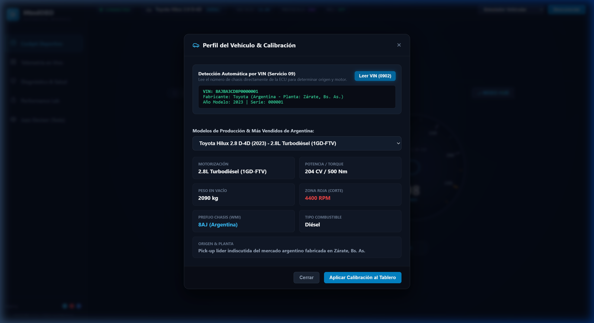
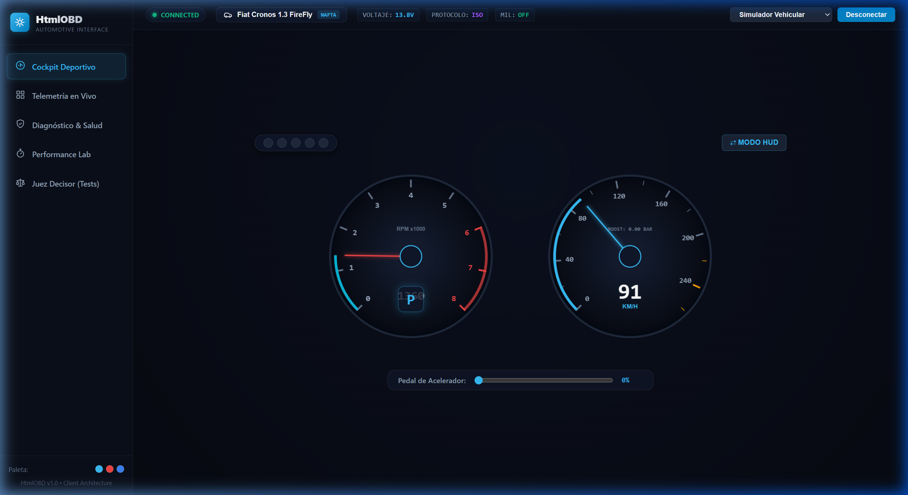
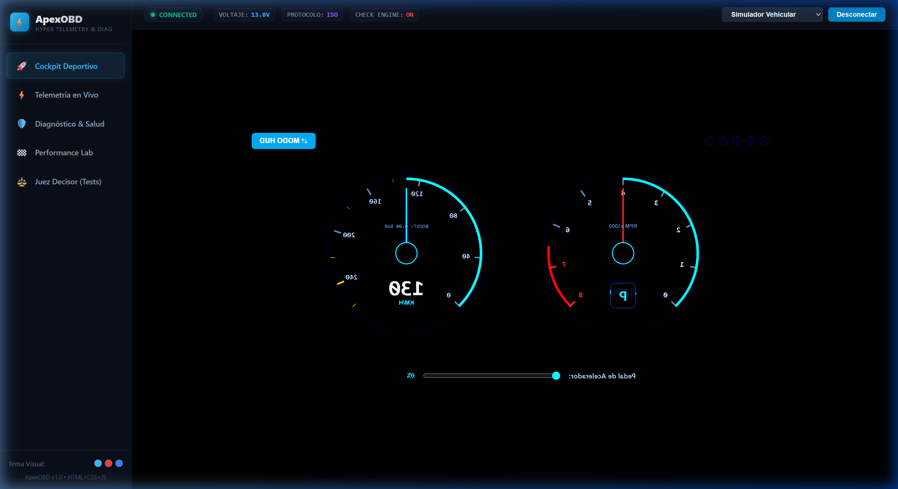
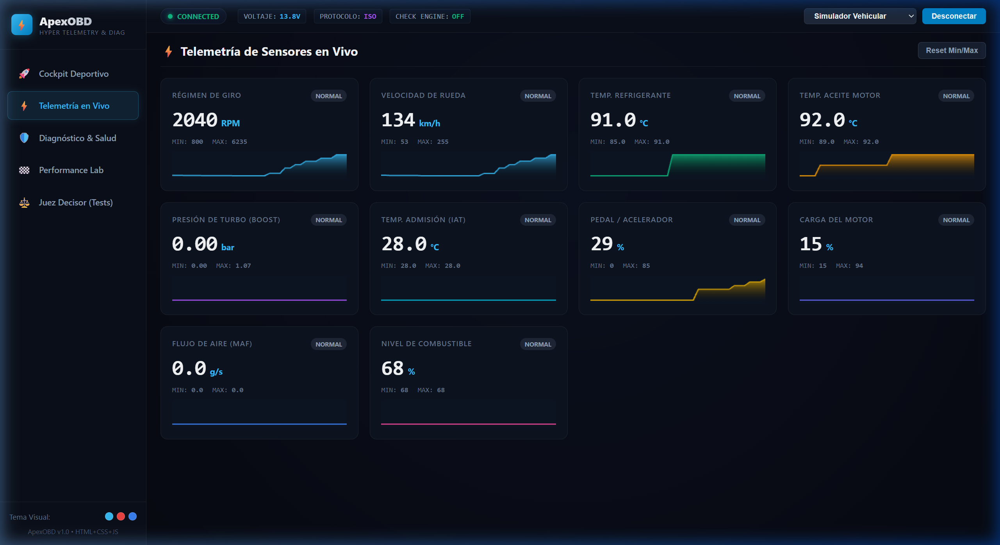
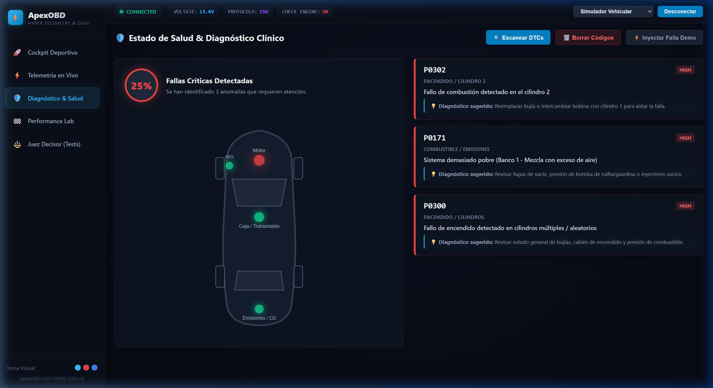
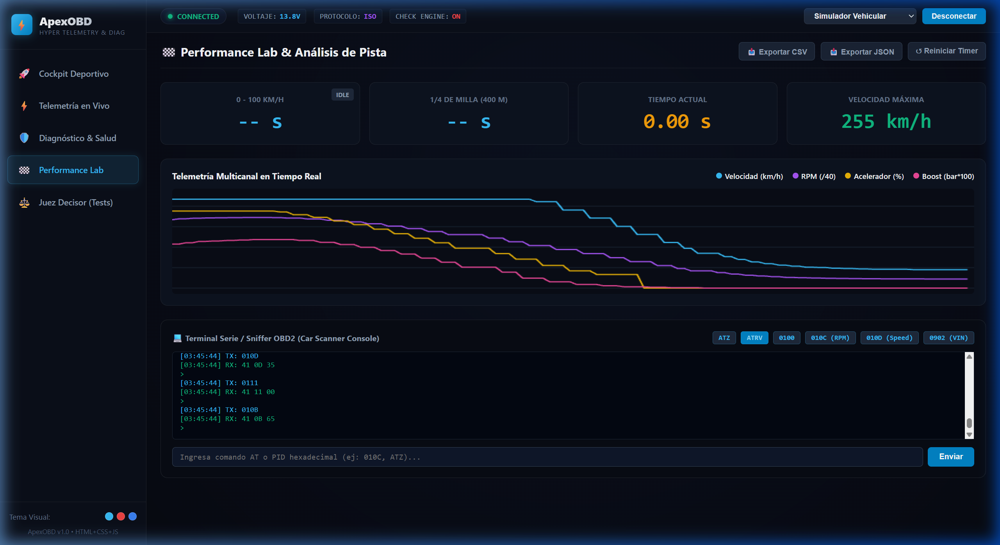
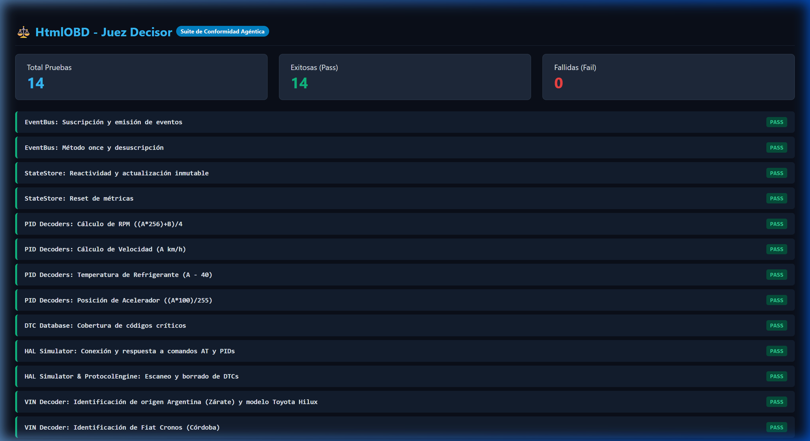
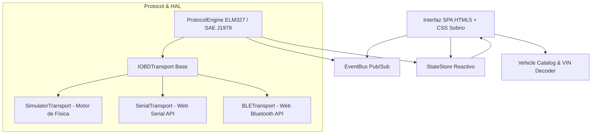

# ⚡ HtmlOBD - Interfaz Web de Telemetría & Diagnóstico Automotriz

> Aplicación web de telemetría y diagnóstico automotriz desarrollada en **HTML5 + Vanilla CSS + JavaScript (ES Modules)**, con soporte para **Web Serial API**, **Web Bluetooth API**, detección de **VIN** (Servicio 09), precarga de **modelos de Argentina** y un simulador de física vehicular integrado.

---

## 🌟 Visión & Síntesis de Referentes de la Industria

**HtmlOBD** integra las mejores características de las aplicaciones de diagnóstico más prestigiosas del mercado internacional, adaptadas con una estética sobria y profesional:

| Referente | Función / Pro Clonado | Implementación en HtmlOBD |
| :--- | :--- | :--- |
| **RealDash** | **Cockpit de Alto Rendimiento** | Instrumentación analógica y digital fluida en Canvas a **60 FPS** con inercia, barrido de agujas (*sweep*), shift lights perimétricos y **Modo HUD** de proyección en parabrisas. |
| **BimmerLink** | **Telemetría Modular OLED** | Cuadrícula responsiva de tarjetas oscuras con micro-gráficos de tendencia (**sparklines**) de 30 segundos, seguimiento de picos **Min/Max** y alertas visuales por umbral. |
| **OBDeleven** | **Salud Global & Visualización de Chasis** | Esquema vectorial SVG del vehículo con detección de fallas por nodo (Motor, Transmisión, Frenos/ABS, Escape) y cálculo porcentual de salud. |
| **Car Scanner** | **Diagnóstico Clínico & Consola** | Lectura y borrado de fallas DTC (**Servicios 03 y 04**), base de datos de severidad y causas probables, y terminal serie interactiva con sniffer de tramas HEX. |
| **RaceChrono** | **Performance Lab & Datalogger** | Cronómetro automático de aceleración (**0–100 km/h** y **1/4 de milla**) por integración de velocidad, gráfica multicanal y exportación a **CSV / JSON**. |

---

## 🇦🇷 Perfiles de Vehículos & Detección por VIN (Argentina)

HtmlOBD incluye un módulo específico para el parque automotor argentino, permitiendo calibrar la escala y corte del tacómetro, pesos y consumos según el modelo:

### 1. Detección Automática por VIN (Servicio 09 PID 02)
* Envía la consulta `0902` a la ECU del auto.
* Decodifica el código **WMI** (primeros 3 caracteres) para identificar el país y la planta de producción (`8AJ` Zárate, `8AP` Córdoba, `8AD` El Palomar, `8AW` Pacheco, `8AF` Pacheco, `8AG` Alvear, `8A1` Santa Isabel).
* Identifica el año del modelo y el número de serie.

### 2. Modelos Preconfigurados
* **Toyota Hilux 2.8 D-4D** (204 CV, Redline: 4.400 RPM, Diésel, Zárate)
* **Fiat Cronos 1.3 FireFly** (99 CV, Redline: 6.000 RPM, Nafta, Córdoba)
* **Peugeot 208 1.6 VTi / Turbo** (115 CV, Redline: 6.200 RPM, El Palomar)
* **Volkswagen Amarok 3.0 V6 TDI** (258 CV, Redline: 4.600 RPM, Diésel, Pacheco)
* **Ford Ranger 3.0 V6 EcoBlue** (250 CV, Redline: 4.500 RPM, Diésel, Pacheco)
* **Chevrolet Cruze 1.4 Turbo** (153 CV, Redline: 6.000 RPM, Alvear)
* **Volkswagen Polo / Gol Trend 1.6 MSI** (110 CV, Redline: 6.200 RPM)
* **Toyota Corolla 2.0 Dynamic Force** (170 CV, Redline: 6.600 RPM)
* **Renault Kangoo II 1.6 SCe** (114 CV, Santa Isabel)
* **Ford Focus III 2.0 Duratec GDI** (170 CV, Pacheco)


*Figura: Modal de selección de vehículos y decodificación automática del VIN.*

---

## 📸 Módulos del Sistema

### 1. Cockpit Deportivo
Instrumentación analógica y digital con tacómetro dinámico que ajusta su zona roja según la motorización seleccionada (ej. 4.400 RPM para Diésel vs 6.000 RPM para Nafta):


#### ⇄ Modo HUD (Proyección en Parabrisas)
Invierte la interfaz en espejo y aumenta el contraste para reflejar la información en el parabrisas de noche:


---

### 2. Telemetría de Sensores en Vivo
Supervisión continua de variables críticas con sparklines en tiempo real:


---

### 3. Diagnóstico y Salud del Vehículo
Inspección visual sobre silueta vectorial, diagnóstico de códigos DTC y borrado seguro de la luz *Check Engine*:


---

### 4. Performance Lab & Terminal Interactiva
Medición de 0-100 km/h, 1/4 de milla, gráfica continua y consola interactiva de comandos OBD2 / AT:


---

### 5. Suite del Juez Decisor (Tests Automatizados)
Validación integral de conformidad con 100% de pruebas aprobadas (14/14 PASS):


---

## 🏗️ Arquitectura Técnica



---

## 🚀 Inicio Rápido

No se requiere ningún paso de compilación:

1. **Clonar el repositorio:**
   ```bash
   git clone https://github.com/cdcespon/HtmlOBD.git
   cd HtmlOBD
   ```

2. **Iniciar servidor web local:**
   * Con **Python**:
     ```bash
     python -m http.server 8080
     ```
   * O con **Node.js**:
     ```bash
     npx serve .
     ```

3. **Abrir en el navegador:**
   Accede a `http://localhost:8080` en **Google Chrome** o **Microsoft Edge**.

---

## 📋 PIDs Soportados

| Código | Descripción | Modo | Decodificación |
| :--- | :--- | :--- | :--- |
| `01 0C` | RPM del Motor | Modo 01 | `((A * 256) + B) / 4` |
| `01 0D` | Velocidad de Rueda | Modo 01 | `A` (km/h) |
| `01 05` | Temp. Refrigerante | Modo 01 | `A - 40` (°C) |
| `01 5C` | Temp. Aceite | Modo 01 | `A - 40` (°C) |
| `01 0B` | Presión Admisión (MAP / Boost) | Modo 01 | `(MAP - 101.3) / 100` (bar) |
| `01 11` | Posición Acelerador (TPS) | Modo 01 | `(A * 100) / 255` (%) |
| `01 04` | Carga de Motor | Modo 01 | `(A * 100) / 255` (%) |
| `01 10` | Flujo de Aire (MAF) | Modo 01 | `((A * 256) + B) / 100` (g/s) |
| `01 2F` | Nivel de Combustible | Modo 01 | `(A * 100) / 255` (%) |
| `03` | Lectura de Fallas DTC | Modo 03 | Decodificación binaria SAE J1979 |
| `04` | Borrado de Fallas & MIL | Modo 04 | Limpieza de registros y reseteo de Check Engine |
| `09 02` | Número VIN del Vehículo | Modo 09 | Multiframe ASCII con decodificación WMI |

---

## 📄 Licencia

MIT License.
