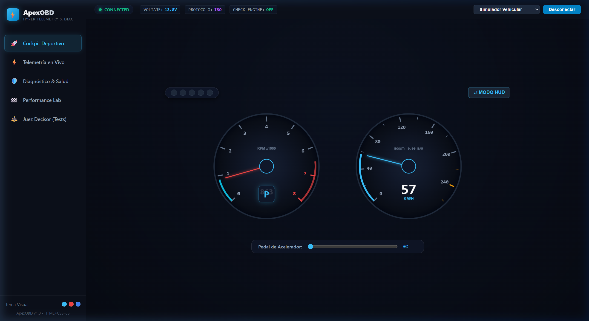
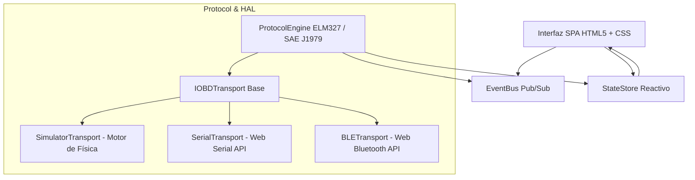

# ⚡ ApexOBD - Next-Gen Automotive Telemetry & OBD2 Diagnostic Web Suite

> Aplicación web de telemetría y diagnóstico automotriz de alto rendimiento desarrollada en **HTML5 + Vanilla CSS + JavaScript (ES Modules)**, con soporte para **Web Serial API**, **Web Bluetooth API** y un motor de física de simulación vehicular integrado.

---

## 🌟 Visión y Fusión de Referentes de Prestigio

**ApexOBD** nace del análisis y clonación selectiva de las mejores características de las aplicaciones líderes de la industria automotriz:

| Referente | Pro Clonado | Implementación en ApexOBD |
| :--- | :--- | :--- |
| **RealDash** | **Impacto Visual & Cockpit Deportivo** | Tacómetro y velocímetro renderizados en Canvas a **60 FPS** con física de aguja, barrido inicial de encendido (*gauge sweep*), barra de luces de cambio (*shift lights*) y **Modo HUD** de proyección en parabrisas con un solo clic. |
| **BimmerLink** | **Telemetría Modular Limpia** | Cuadrícula responsiva de tarjetas oscuras OLED con micro-gráficos de tendencia (**sparklines**) en tiempo real, seguimiento de picos **Min/Max** y alertas visuales automáticas por umbral. |
| **OBDeleven** | **Salud Global & Virtualización** | Esquema vectorial SVG del chasis con puntos calientes (*hotspots*) que cambian de color según el estado del subsistema (Motor, Transmisión, ABS, Emisiones) e indicador de **Salud del Vehículo (0–100%)**. |
| **Car Scanner** | **Diagnóstico Clínico & Consola** | Lectura y borrado de fallas DTC (**Servicios 03 y 04**), base de datos de severidad y soluciones sugeridas, y **Terminal interactiva** con sniffer de tramas TX/RX y chips de comandos rápidos. |
| **RaceChrono** | **Performance Lab & Datalogger** | Cronómetro automático de aceleración (**0–100 km/h** y **1/4 de milla**) accionado por detección de movimiento, gráfica multicanal continua y exportación de datos a **CSV / JSON**. |

---

## 📸 Galería de Módulos

### 1. Cockpit Deportivo (Inspirado en RealDash)
Instrumentación analógica/digital fluida con inercia, indicador de marcha, control de pedal y modo HUD en espejo:


#### ⇄ Modo HUD (Head-Up Display para Parabrisas)
Invierte la interfaz en espejo horizontal y optimiza el contraste para reflejar la velocidad y RPM directamente en el vidrio del parabrisas durante la noche:


---

### 2. Telemetría de Sensores en Vivo (Inspirado en BimmerLink)
Lectura de RPM, Velocidad, Temperatura de Refrigerante/Aceite, Presión de Turbo (Boost), Carga y MAF con sparklines independientes:


---

### 3. Diagnóstico Clínico y Salud del Vehículo (Inspirado en OBDeleven + Car Scanner)
Vista superior del auto con detección visual de fallas por nodo, medidor de salud porcentual y tarjetas de fallas DTC expandibles con borrado de luz *Check Engine*:


---

### 4. Performance Lab & Consola de Ingeniería (Inspirado en RaceChrono + Car Scanner)
Medición de aceleración por integración numérica, gráfica temporal multipista, exportación de telemetría y terminal serie en vivo:


---

### 5. Suite de Validación del Juez Decisor
Batería de pruebas unitarias y de integración que certifica el cumplimiento del contrato agéntico, fórmulas de decodificación y estabilidad del motor:


---

## 🏗️ Arquitectura del Sistema

El proyecto sigue una arquitectura desacoplada y orientada a eventos (**Event-Driven Reactive Architecture**):



### Capa de Abstracción de Hardware (HAL)
- **`SimulatorTransport`**: Simula una ECU con dinámica de aceleración, curvas de RPM, cambios de marcha, temperaturas realistas, soplado de turbo e inyección de fallas DTC. Permite probar el 100% de la aplicación sin necesidad de hardware.
- **`SerialTransport`**: Comunicación directa por cable USB o puertos COM virtuales Bluetooth mediante `navigator.serial`.
- **`BLETransport`**: Comunicación inalámbrica de bajo consumo mediante `navigator.bluetooth` compatible con dongles OBD2 BLE (Vgate, Veepeak, Carista, etc.).

---

## 🚀 Puesta en Marcha

No requiere ningún proceso de compilación ni instalación de dependencias pesadas:

1. **Clonar el repositorio:**
   ```bash
   git clone https://github.com/cdcespon/HtmlOBD.git
   cd HtmlOBD
   ```

2. **Iniciar un servidor web local:**
   * Con **Python**:
     ```bash
     python -m http.server 8080
     ```
   * O con **Node.js**:
     ```bash
     npx serve .
     ```

3. **Abrir en el navegador:**
   Navega a `http://localhost:8080` en **Google Chrome**, **Microsoft Edge** o cualquier navegador basado en Chromium.

---

## 📋 Catálogo de PIDs y Comandos Implementados

| Código | Descripción | Modo SAE J1979 | Fórmula de Decodificación |
| :--- | :--- | :--- | :--- |
| `01 0C` | Régimen de Giro (RPM) | Modo 01 | `((A * 256) + B) / 4` |
| `01 0D` | Velocidad del Vehículo | Modo 01 | `A` (km/h) |
| `01 05` | Temp. Refrigerante | Modo 01 | `A - 40` (°C) |
| `01 5C` | Temp. Aceite Motor | Modo 01 | `A - 40` (°C) |
| `01 0B` | Presión Múltiple (MAP) | Modo 01 | `A` (kPa) $\rightarrow$ `(MAP - 101.3)/100` (bar) |
| `01 11` | Posición del Acelerador (TPS) | Modo 01 | `(A * 100) / 255` (%) |
| `01 04` | Carga Calculada del Motor | Modo 01 | `(A * 100) / 255` (%) |
| `01 10` | Flujo de Aire (MAF) | Modo 01 | `((A * 256) + B) / 100` (g/s) |
| `01 2F` | Nivel de Combustible | Modo 01 | `(A * 100) / 255` (%) |
| `03` | Lectura de Códigos de Falla | Modo 03 | Decodificación de tramas binarias SAE (P, C, B, U) |
| `04` | Borrado de Fallas / Apagado MIL | Modo 04 | Limpieza de registros y reseteo de Check Engine |
| `ATZ` / `ATRV` | Comandos ELM327 | AT | Reset de adaptador y lectura de voltaje de batería |

---

## 📄 Licencia

Desarrollado bajo licencia **MIT**. Libre para uso educativo, prototipado y proyectos automotrices.
